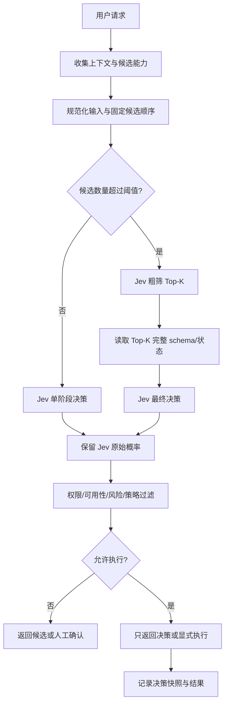

# JevRouter 产品需求原型

> 面向 GPT-6 研发的产品需求草案
> 
> 版本：v0.1（基于需求访谈整理）  
> 日期：2026-09-18  
> 产品形态：开源、本地优先、轻量 CLI/进程

## 1. 产品定义

JevRouter 是一个基于 Jev 的本地 Agent 能力路由器。它接收用户请求、当前状态和能力描述，调用 Jev 输出结构化概率决策，再由 Router 根据权限、可用性和策略过滤候选能力，帮助 Agent 更快、更稳定地选择合适的 Tool。

MVP 必须支持四类路由对象：

- Skill
- MCP Tool
- CLI
- DSH（DeepSeek Harness）Plugin/能力入口

产品首要目标是让程序员和开发者能够将 JevRouter 接入自己的 Agent，用统一方式从多个候选 Tool 中选择更合适的一个，并保留 Jev 的原始概率输出。

## 2. 需求来源与证据边界

### 2.1 用户已确认的产品要求

- 面向程序员和开发者。
- 项目全量开源。
- 第一阶段只做本地运行，不考虑云端 Router 服务。
- 使用 Jev 官方 API key 接入 Jev。
- OpenRouter 等 Provider 提供后续模型能力或 fallback 能力。
- MVP 必须支持 Skill、MCP Tool、CLI、DSH。
- Jev 负责结构化分类、风险判断和候选概率输出。
- 必须保留 Jev 的原始概率；Router 不得伪造或重写概率。
- Router 可以增加权限、可用性和策略字段，并过滤不允许的候选。
- 目标是比现有 Router 更快、消耗更低、相同输入重复运行时结果更一致。
- 首个产品展示应体现“更智能地选择 Tool”。

### 2.2 外部资料的使用边界

以下内容来自公开资料或 TypeSafe 自述，仅作为设计参考，不能直接当作第三方验证结论：

- Jev 的定位是将非结构化状态转换为 typed probabilistic decisions。
- TypeSafe 公开了 Choice、Score、Noul、parallel questions、confidence routing 等概念。
- TypeSafe 的 Skill suggestion cookbook 展示了先对大量候选 Skill 排序，再读取 Top-K 详情并最终选择的两阶段流程。
- TypeSafe 的 function calling cookbook 展示了自然语言到 typed function 与参数的映射。
- DeepSeek Harness（`dsh`）官方仓库将自身描述为“Everything is a Plugin”的开源 Agent harness，目前为 developer preview，存在兼容性破坏风险。

参考资料：

- [Jev 技术介绍与生态资料](./Jev_TypeSafe_AI_技术介绍与生态资料.md)
- [TypeSafe AI：Introducing System One Models and Jev](https://typesafe.ai/blog/introducing-system-one-models-and-jev)
- [TypeSafe AI 文档](https://docs.typesafe.ai/)
- [TypeSafe Skill Suggestion Cookbook](https://docs.typesafe.ai/cookbooks/skill_suggestion.md)
- [TypeSafe Function Calling Cookbook](https://docs.typesafe.ai/cookbooks/function_calling.md)
- [DeepSeek Harness](https://github.com/deepseek-ai/deepseek-harness)

## 3. MVP 目标与非目标

### 3.1 MVP 目标

1. 能在本地注册或发现 Skill、MCP Tool、CLI、DSH 能力。
2. 将不同能力统一转换为候选能力描述。
3. 将用户请求和候选能力交给 Jev，获得可解析的结构化决策。
4. 返回包含 Jev 原始概率的候选列表。
5. 根据权限、可用性、策略和风险过滤候选。
6. 在相同输入、相同候选快照下，尽可能稳定地返回相同决策。
7. 提供 CLI，便于开发者注册能力、执行路由、查看决策和回放评测。
8. 支持“只决策”模式，并为后续安全的“决策后执行”保留接口。

### 3.2 MVP 非目标

- 不提供云端 Router 服务。
- 不训练或重实现 Jev 模型。
- 不把 openjev 或 daseinlabs/open-jev 当作 TypeSafe 官方 Jev 的等价实现。
- 不在第一阶段构建完整 Web 控制台。
- 不让 Router 修改 Jev 的概率值。
- 不把高风险执行完全交给概率模型自动决定。
- 不在没有安全策略的情况下自动执行任意 CLI 或 MCP Tool。

## 4. 默认产品决策

以下是研发可以直接采用的默认方案；若产品负责人后续修改，以新决策为准：

| 领域 | 默认方案 |
|---|---|
| 语言与运行时 | TypeScript + Node.js |
| 交付形态 | 本地 CLI + 可选本地 HTTP 进程 |
| Jev 接入 | Jev 官方 API key，通过环境变量或本地凭证文件注入 |
| LLM Provider | OpenRouter 等作为执行层或 fallback Provider，不替代 Jev 决策 |
| 路由方式 | 候选较少时单阶段；候选较多时两阶段 Top-K 路由 |
| 默认权限 | 只决策，不执行 |
| 执行模式 | 显式 `--execute` 或配置开启；高风险动作需要人工确认 |
| 能力发现 | 自动读取 MCP schema、Skill 描述和 CLI `--help`，允许 manifest 覆盖 |
| 低置信度 | 按风险策略处理；无安全 fallback 时返回 `no_decision` |
| 首个 Demo | 自然语言请求在多个 typed Tool 中选择，并填充 typed 参数 |

## 5. 核心用户流程



## 6. 统一能力模型

所有能力都必须转换成统一的 `CapabilityManifest`。能力的来源类型不改变路由输出结构。

```yaml
id: github.issue.search
name: Search GitHub issues
type: mcp_tool # skill | mcp_tool | cli | dsh
version: 1.0.0
description: Search issues in a GitHub repository
input_schema:
  type: object
  properties:
    repository: { type: string }
    query: { type: string }
  required: [repository, query]
output_schema:
  type: object
permissions:
  - github.read
risk:
  level: low
  categories: [external_read]
availability:
  command: github-issue-search
  healthcheck: true
execution:
  mode: mcp
  target: github
policy:
  requires_confirmation: false
metadata:
  source: local
  tags: [github, issue, search]
```

### 6.1 能力来源适配器

- `SkillAdapter`：读取 Skill 元数据、描述、输入输出约定和调用入口。
- `McpToolAdapter`：读取 MCP server/tool schema、权限和连接状态。
- `CliAdapter`：读取 CLI 名称、`--help`、参数 schema、退出码和执行命令。
- `DshAdapter`：读取 DSH plugin manifest 或插件注册信息；由于 DSH 仍可能快速变化，适配器必须隔离兼容性变化。

### 6.2 注册优先级

1. 显式 manifest
2. 自动发现结果
3. 运行时健康检查
4. 本地策略覆盖

显式 manifest 可以覆盖名称、描述、风险、权限、成本、稳定性和执行方式，但不能伪造 Jev 的决策概率。

## 7. Jev 决策契约

Router 必须原样保存 Jev 返回的 choice、score、noul、probability 和 confidence 字段。Router 可添加派生字段，但不得将派生分数写回 Jev 概率字段。

建议统一输出：

```json
{
  "request_id": "req_01JEV...",
  "decision_id": "dec_01JEV...",
  "mode": "decision_only",
  "decision": {
    "kind": "choice",
    "question": "Which tool should handle this request?",
    "selected": "github.issue.search",
    "candidates": [
      {
        "id": "github.issue.search",
        "type": "mcp_tool",
        "jev_probability": 0.86,
        "jev_confidence": 0.86,
        "router": {
          "available": true,
          "allowed": true,
          "risk_level": "low",
          "requires_confirmation": false,
          "filtered": false,
          "filter_reason": null
        }
      },
      {
        "id": "github.issue.create",
        "type": "mcp_tool",
        "jev_probability": 0.09,
        "jev_confidence": 0.09,
        "router": {
          "available": true,
          "allowed": true,
          "risk_level": "medium",
          "requires_confirmation": true,
          "filtered": false,
          "filter_reason": null
        }
      }
    ]
  },
  "fallback": null,
  "execution": {
    "enabled": false,
    "status": "not_started"
  },
  "provenance": {
    "jev_provider": "typesafe",
    "candidate_snapshot_hash": "sha256:...",
    "policy_hash": "sha256:..."
  }
}
```

### 7.1 关键约束

- `jev_probability` 只能来自 Jev 原始响应。
- Router 过滤候选后，不得把剩余概率重新归一化为“新的 Jev 概率”。
- 如果 Router 需要排序，必须增加 `router_rank`，不能覆盖 Jev 原始排序或概率。
- 若没有安全可执行候选，返回 `no_decision`。
- 若 Jev 返回无法判断，保留原始响应并设置 `fallback`。

## 8. 路由策略

### 8.1 单阶段路由

候选数量低于配置阈值时：

1. 规范化请求。
2. 固定候选顺序。
3. 一次 Jev 请求完成 Choice/Score/Noul 决策。
4. 应用 Router 策略。

### 8.2 两阶段路由

候选数量超过阈值时：

1. 第一次 Jev 请求对全部候选做粗筛。
2. 取 Top-K 候选。
3. 读取 Top-K 的完整 schema、权限和实时可用性。
4. 第二次 Jev 请求做最终选择。
5. 保留两次决策的原始响应和候选快照。

### 8.3 过滤顺序

建议顺序：

1. 能力是否存在。
2. 能力版本是否兼容。
3. 能力是否可用。
4. 调用者是否有权限。
5. 风险策略是否允许。
6. 是否需要人工确认。
7. 最后依据 Jev 概率选择候选。

Router 不应使用静态规则直接覆盖 Jev 结果；静态规则用于硬过滤、权限和安全边界。

## 9. 安全与人工确认

风险策略由配置文件管理，至少支持：

- `low`：可在允许范围内自动执行。
- `medium`：默认人工确认。
- `high`：默认拒绝或人工确认后执行。
- `critical`：默认拒绝。

以下情况必须阻止自动执行：

- 权限不足。
- 能力不可用或健康检查失败。
- Jev 置信度低于策略阈值。
- 候选之间概率接近且风险较高。
- CLI 会产生不可逆外部影响。
- MCP Tool 涉及写入、删除、支付、账户、部署或权限变更。

任何执行能力都必须支持 dry-run 或等价的预览路径，尤其是 CLI 和 DSH Plugin。

## 10. API key 与配置

推荐配置优先级：

1. 命令行参数（仅用于临时调试）
2. 项目 `.env` 或用户级配置
3. 环境变量
4. 本地凭证存储

建议环境变量：

```bash
JEV_API_KEY=...
OPENROUTER_API_KEY=...
JEV_PROVIDER=typesafe
JEV_ROUTER_MODE=decision_only
JEV_ROUTER_POLICY=./jevrouter.policy.yaml
```

要求：

- 不把 key 写入 manifest、决策快照或普通日志。
- 日志只记录 provider 名称、请求 ID、延迟和错误类别。
- 对外展示决策时可显示 provider，但不显示完整 key。
- 本地 Router 不默认上传候选描述、对话或工具结果到第三方服务；是否发送给 Jev 由调用者明确配置。

## 11. CLI 原型

命令名暂定为 `jevrouter`。

```bash
# 初始化项目
jevrouter init

# 注册显式 manifest
jevrouter capability add ./capabilities/github.issue.search.yaml

# 扫描本地 Skill、MCP 和 CLI
jevrouter discover --skills ./skills --mcp ./mcp.json --cli github,docker

# 查看候选能力
jevrouter capability list

# 只做路由决策
jevrouter route \
  --request "查找这个仓库里关于登录失败的 issue" \
  --format json

# 查看原始 Jev 响应和 Router 派生字段
jevrouter decision show <decision-id> --include-raw-jev

# 显式开启执行（默认关闭）
jevrouter route \
  --request "查找这个仓库里关于登录失败的 issue" \
  --execute \
  --confirm

# 运行稳定性评测
jevrouter eval run ./evals/tool-routing.jsonl
```

## 12. 首个 Demo

### 12.1 Demo 目标

演示用户用自然语言提出请求，JevRouter 在多个 typed Tool 中做更稳定的选择，并输出参数和原始概率。

### 12.2 示例

用户请求：

> 查询 `owner/repo` 中最近 30 天关于登录失败的 issue，并按严重程度排序。

候选 Tool：

- `github.issue.search`（MCP Tool）
- `github.issue.create`（MCP Tool）
- `github.repo.clone`（CLI）
- `summarize_issues`（Skill）
- `dsh.github.workflow`（DSH Plugin）

预期决策：

1. Jev 选择 `github.issue.search`。
2. Jev 输出 Tool 选择概率和 typed 参数判断。
3. Router 检查 GitHub 读取权限和 MCP 可用性。
4. Router 判断为低风险，可在策略允许时执行。
5. 执行结果可交给 `summarize_issues` Skill 处理。
6. 若 Jev 低置信度或 MCP 不可用，返回候选和 fallback，不擅自调用高风险能力。

### 12.3 Demo 成功条件

- 选择正确 Tool。
- 参数 schema 可验证。
- Jev 原始概率完整展示。
- Router 字段能解释为什么某个候选被保留或过滤。
- 相同输入和相同候选快照重复运行，结果稳定。
- 默认模式不执行外部副作用。

## 13. 评测方案

### 13.1 必测指标

- Top-1 Tool 命中率。
- Top-3 候选覆盖率。
- 相同输入重复运行的一致率。
- 无效 Tool 调用率。
- `no_decision` 比例。
- Jev 请求 p50/p95 延迟。
- Router 总 p50/p95 延迟。
- 单次路由 token/API 消耗。
- 权限过滤准确率。
- 高风险调用拦截率。

### 13.2 评测集结构

```json
{
  "id": "tool-routing-001",
  "request": "查找登录失败相关 issue",
  "context": {},
  "candidate_ids": [
    "github.issue.search",
    "github.issue.create",
    "github.repo.clone"
  ],
  "expected_top1": "github.issue.search",
  "acceptable_top3": ["github.issue.search"],
  "risk_expectation": "low",
  "must_require_confirmation": false
}
```

### 13.3 稳定性测试

同一条样本至少重复运行多次，并区分：

- 相同候选快照、相同策略、相同 Jev 配置。
- 工具描述变化。
- 某个候选不可用。
- Jev 请求超时或返回 malformed response。
- 候选数量从单阶段阈值内外变化。

## 14. 错误与回退

统一错误类别：

- `jev_auth_error`
- `jev_timeout`
- `jev_malformed_response`
- `capability_not_found`
- `capability_unavailable`
- `permission_denied`
- `policy_blocked`
- `low_confidence`
- `ambiguous_decision`
- `execution_failed`

默认回退顺序：

1. 重试一次可安全重试的 Jev 请求。
2. 若有缓存且候选快照未变化，返回标注为 cached 的决策。
3. 低风险请求可按配置回退 OpenRouter 或静态规则。
4. 中高风险请求要求人工选择。
5. 没有安全回退时返回 `no_decision`。

## 15. 项目结构建议

```text
jevrouter/
├── packages/
│   ├── core/                 # 决策模型、候选过滤、策略
│   ├── jev-provider/         # Jev 官方 API client
│   ├── capability-model/     # CapabilityManifest 与 schema
│   ├── adapters/
│   │   ├── skill/
│   │   ├── mcp/
│   │   ├── cli/
│   │   └── dsh/
│   ├── execution/            # dry-run、确认、执行编排
│   ├── providers/             # OpenRouter 等 provider
│   └── cli/                   # jevrouter CLI
├── capabilities/
├── policies/
├── evals/
├── examples/
├── docs/
└── README.md
```

## 16. MVP 交付分期

### M0：协议与只读路由

- 定义 `CapabilityManifest`。
- 实现 Jev Provider 接口。
- 实现 MCP Tool、Skill、CLI、DSH 适配器骨架。
- 实现只决策模式和 JSON 输出。
- 保留 raw Jev response。

### M1：本地发现与稳定性

- 自动发现能力。
- 输入规范化、候选固定排序和快照 hash。
- 单阶段/两阶段路由。
- 决策缓存和回放。
- CLI 初始化、注册、发现、路由、查看决策。

### M2：安全策略与可控执行

- 权限和策略文件。
- dry-run。
- 人工确认。
- CLI/MCP/Skill/DSH 执行器。
- OpenRouter fallback 接口。
- 执行结果记录。

### M3：公开 Demo 与开源发布

- 完成 Tool function calling Demo。
- 提供评测数据集和基线。
- 编写 README、架构说明、Provider 接入说明。
- 发布 MIT 或项目负责人确认的开源许可证。
- 标记 DSH 适配器的兼容版本和实验性质。

## 17. 验收标准

### 功能验收

- [ ] 四类能力均能注册或发现：Skill、MCP Tool、CLI、DSH。
- [ ] 能使用 Jev API key 发起路由请求。
- [ ] 输出包含 Jev 原始概率和 confidence。
- [ ] Router 能添加权限、可用性、风险和策略字段。
- [ ] Router 能过滤候选但不会重写 Jev 概率。
- [ ] 默认只决策，不执行外部副作用。
- [ ] 显式执行模式支持确认和 dry-run。
- [ ] Jev 失败、低置信度和无匹配时有明确回退。

### 质量验收

- [ ] 相同输入和候选快照的重复一致率达到项目设定阈值。
- [ ] 关键错误有可读错误码。
- [ ] 决策可通过 ID 回放。
- [ ] key 不出现在日志、manifest 和快照中。
- [ ] MCP、CLI、DSH 适配器的外部副作用均有测试隔离。
- [ ] 文档包含已验证事实、官方自述和研发假设的区分。

## 18. 待最终确认的问题

以下内容尚未由产品负责人明确回答，研发可以暂按默认方案实现，但发布前必须确认：

1. Router MVP 是否只决策，还是同时开放 `--execute` 执行模式。
2. 单阶段与两阶段路由的候选数量阈值和 Top-K 值。
3. DSH Plugin manifest 的具体格式和兼容版本策略。
4. OpenRouter 是仅作 fallback，还是由 Router 负责调用被选中能力背后的 Agent。
5. 低置信度时的具体阈值和不同风险等级的回退策略。
6. 开源许可证最终采用 MIT、Apache-2.0 或其他许可证。
7. Jev 官方 API 的实际请求 schema、限流、超时和缓存条款。
8. 第一批真实 Tool 和评测样本。

## 19. 给 GPT-6 研发的执行指令

请基于本文档实现 JevRouter MVP，遵守以下原则：

1. 先实现只决策路径，再实现可控执行路径。
2. 先定义稳定的 `CapabilityManifest` 和 `JevDecision` 类型，再实现各适配器。
3. 保留 Jev 原始响应，任何 Router 派生字段都放在独立命名空间。
4. 不要把 Router 过滤后的概率重新归一化为 Jev 概率。
5. 默认拒绝外部副作用；执行必须显式开启，并经过权限、策略和确认。
6. 优先实现 TypeScript + Node.js CLI。
7. 用固定候选顺序、输入规范化、候选快照和决策回放提升重复一致性。
8. 为 Jev 官方 API、OpenRouter、MCP、CLI、Skill、DSH 分别设计可替换接口。
9. 提供最小可运行的 Tool function calling Demo 和离线评测集。
10. 在 README 中明确哪些性能与准确性数字来自 TypeSafe 官方自测，哪些是本项目实测。
